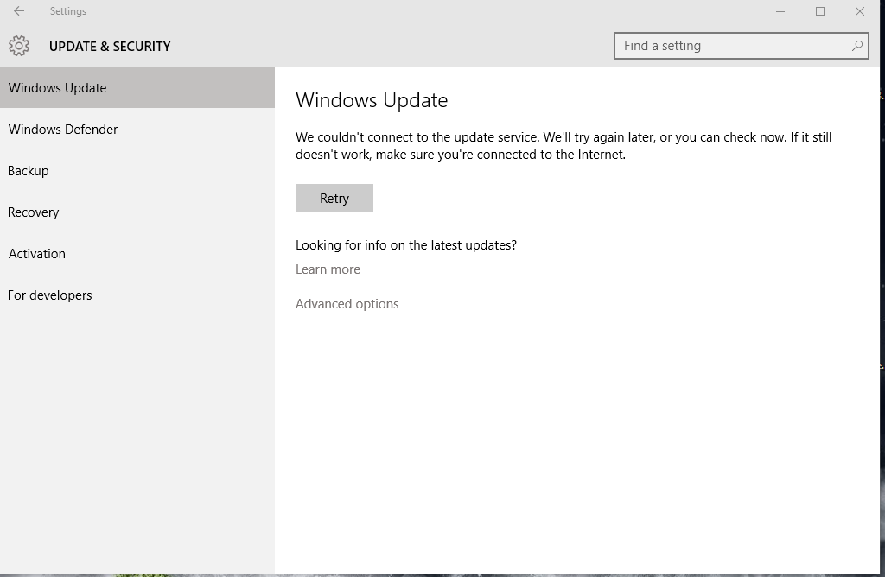

# FAQ

* [Who is behind WindowsSpyBlocker?](#who-is-behind-windowsspyblocker)
* [No Internet access on my network card](#no-internet-access-on-my-network-card)
* [Couldn't connect to the update service](#couldnt-connect-to-the-update-service)
* [What is NCSI?](#what-is-ncsi)
* [Antivirus complains about WindowsSpyBlocker](#antivirus-complains-about-windowsspyblocker)

## Who is behind WindowsSpyBlocker?

Hi, I'm [CrazyMax](https://crazymax.dev/). This project is self-funded and developed using my decade of experience building open source software.

By [supporting me](https://www.patreon.com/crazymax), you're not only sustaining this project, but rather all of [my open source projects](https://github.com/crazy-max).

## No Internet access on my network card

Windows check a Microsoft site for connectivity, using the Network Connectivity Status Indicator site.

* NCSI performs a DNS lookup on `www.msftconnecttest.com`, then requests `http://www.msftconnecttest.com/connecttest.txt`. This file is a plain-text file and contains only the text `Microsoft Connect Test`.
* NCSI sends a DNS lookup request for `dns.msftncsi.com`. This DNS address should resolve to `131.107.255.255`. If the address does not match, then it is assumed that the internet connection is not functioning correctly.

If you want to implement your own NCSI, [check this link](http://blog.superuser.com/2011/05/16/windows-7-network-awareness/). 
More info : https://technet.microsoft.com/en-us/library/cc766017%28WS.10%29.aspx

## Couldn't connect to the update service

> We couldn't connect to the update service. We'll try again later, or you can check now. If it still doesn't work, make sure you're connected to the Internet.

If you've got this message when you want to process a Windows Update, there's maybe a problem with some hosts and/or firewall rules that need to be updated :
* First remove all WindowsSpyBlocker firewall rules (with the executable) and check again. If it works [post an issue](https://github.com/crazy-max/WindowsSpyBlocker/issues/new).
* Otherwise remove WindowsSpyBlocker hosts and check again. If it works [post an issue](https://github.com/crazy-max/WindowsSpyBlocker/issues/new).
* Otherwise there is a problem with your ISP !

But several tools are available to update offline :
* [WSUS Offline Update](http://www.wsusoffline.net/) : Using "WSUS Offline Update" (formerly known as "ct offline update" or "DIY Service Pack"), you can update any computer running Microsoft Windows safely, quickly and without an Internet connection.
* [AutoPatcher](http://www.autopatcher.com/) : Combines the advantage of both Windows Update (presentation and description of updates and automated installation), and the special administrative updates (portability and installation without the need of an Internet connection).
* [Portable Update](http://www.portableupdate.com/) : Updating a Microsoft Windows computer in a completely disconnected environment.
* [WHDownloader](http://forums.mydigitallife.info/threads/66243-WHDownloader-Download) : Formerly called the Windows Hotfix Downloader, is a lightweight and easy to use downloader used for finding and applying the latest Microsoft Windows updates.

## What is NCSI?

The NCSI is used within the Network Awareness API and shows the Internet connectivity with the Network Connection Status Icon in the system tray. This mechanism can be configured by registry keys of the "Network Location Awareness" service.

The internet connectivity is determined by four steps :

In the first step, an IPv4 HTTP request is compared to a known string stored in the registry. If the request returns the expected characters, the Internet connection is considered to be available. If the request fails, the same mechanism is used with an IPv6 URL. If both fail, the third step tries to resolve an IPv4 DNS name and, if this fails again, an IPv6 DNS resolution is used. If all four steps fail, then the Internet connection is considered to be not available. 

Credit: http://www.codeproject.com/Tips/1077317/Test-for-Internet-Connectivity-the-Windows-Way

## Antivirus complains about WindowsSpyBlocker

Releases of WSB are scanned by [VirusTotal](https://www.virustotal.com) and a link is provided in the description.

Every detections found by VirusTotal scan are generic. Most likely based on a heuristic detection. Heuristics are more prone to false-positive detections.

This [happens quite often](https://github.com/golang/go/issues?utf8=%E2%9C%93&q=is%3Aissue%20antivirus) with programs written in [Golang](https://golang.org/). The best you can do is to [report this](https://github.com/crazy-max/WindowsSpyBlocker/issues/82#issuecomment-337611345) to your Antivirus software vendor.

But if the detection is legitimate, you can still [post an issue](https://github.com/crazy-max/WindowsSpyBlocker/issues/new).
