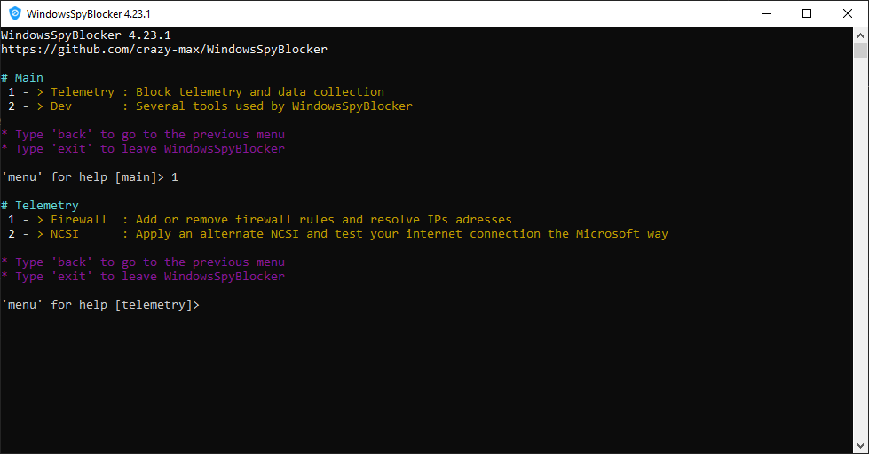
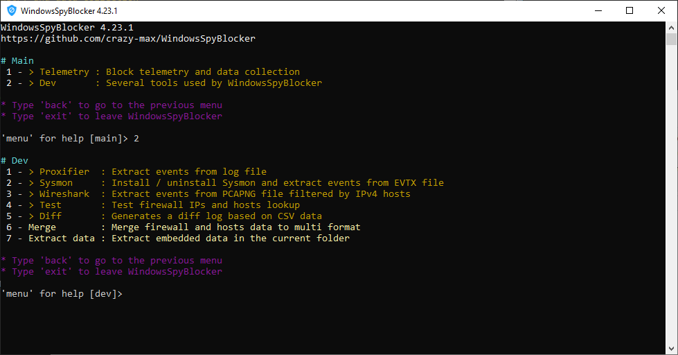

# Usage

* [Download](#download)
* [First launch](#first-launch)
* [Menu](#menu)
  * [Telemetry](#telemetry)
  * [Dev](#dev)
* [Data](#data)

## Download

* Directly from [GitHub releases](https://github.com/crazy-max/WindowsSpyBlocker/releases/latest)
* As a [Chocolatey package](https://chocolatey.org/packages/windowsspyblocker) that will allow you to benefit from automatic updates
* As a [Scoop](https://scoop.sh/) package (`windowsspyblocker`) that will allow you to benefit from automatic updates

## First launch

When you execute WindowsSpyBlocker for the first time, a configuration file named `app.conf` is generated:

This configuration file is especially necessary for people who want to contribute to the project. See [dev](#dev) section.

## Menu

> Main window of WindowsSpyBlocker

### Telemetry

> Telemetry menu

Telemetry menu allows you to apply rules to the Windows firewall, to modify the NCSI and also to help contribute to the project!

* [Firewall](app/telemetry/firewall.md)
* [NCSI](app/telemetry/ncsi.md)

### Dev

> Dev menu

Dev menu mainly concerns developers or curious people who would like to contribute to WindowsSpyBlocker. Several applications are used by WindowsSpyBlocker to generate and capture traffic.

* QEMU
* [Proxifier](app/dev/proxifier.md)
* [Sysmon](app/dev/sysmon.md)
* [Wireshark](app/dev/wireshark.md)
* Test
* Diff
* Merge
* Extract data

## Data

[`data`](../data) folder contains blocking rules based on domains or IPs detected during the [capture process](how-it-works.md):

### `data/<type>/spy.txt`

> ✅ Recommended

Block Windows Spy / Telemetry

### `data/<type>/update.txt`

Block Windows Update

### `data/<type>/extra.txt`

> :warning: ONLY use if you know what you do

Block third party applications like Skype, Bing, Live, Outlook, NCSI, Microsoft Office. Be aware that these rules can also block Windows Update and other services. Therefore, no support will be provided on them.

`data/hosts/[extra|spy|update]_v6.txt` handle IPv6 blocking for hosts.

[`data/firewall`](data/firewall.md) and [`data/hosts`](data/hosts.md) data are the main types. Others are generated from these as:

* [ESET Firewall](data/eset.md) : a proprietary firewall solution.
* [DNSCrypt](data/dnscrypt.md) : a protocol for securing communications between a client and a DNS resolver.
* [OpenWrt](data/openwrt.md) : an open source project used on embedded devices to route network traffic.
* [P2P](data/p2p.md) : a plaintext IP data format from PeerGuardian.
* [Proxifier](data/proxifier.md) : an advanced proxy client on Windows with a flexible rule system.
* [simplewall](data/simplewall.md) : a simple tool to configure Windows Filtering Platform (WFP).
